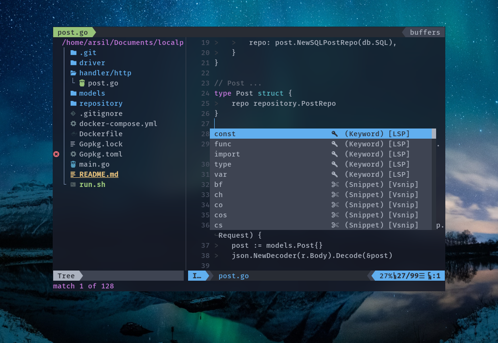

# Arsil's Neovim Setup

**Warning**: Just my personal Vim Setup

## (N)Vim setup

Requires Neovim (>= 0.5)

- [vim-plug](https://github.com/junegunn/vim-plug)
- [vim-fugitive](https://github.com/tpope/vim-fugitive)
- [which-key.nvim](https://github.com/folke/which-key.nvim)
- [nvim-lspconfig](https://github.com/neovim/nvim-lspconfig)
- [nvim-lspinstall](https://github.com/kabouzeid/nvim-lspinstall)
- [nvim-compe](https://github.com/hrsh7th/nvim-compe)
- [vim-vsnip](https://github.com/hrsh7th/vim-vsnip)
- [friendly-snippets](https://github.com/rafamadriz/friendly-snippets)
- [vim-prettier](https://github.com/prettier/vim-prettier)
- [ale](https://github.com/dense-analysis/ale)
- [nvim-tree.lua](https://github.com/kyazdani42/nvim-tree.lua)
- [vim-airline](https://github.com/vim-airline/vim-airline)
- [vim-floaterm](https://github.com/voldikss/vim-floaterm)
- [telescope.nvim](https://github.com/nvim-telescope/telescope.nvim)
- [vim-startify](https://github.com/mhinz/vim-startify)
